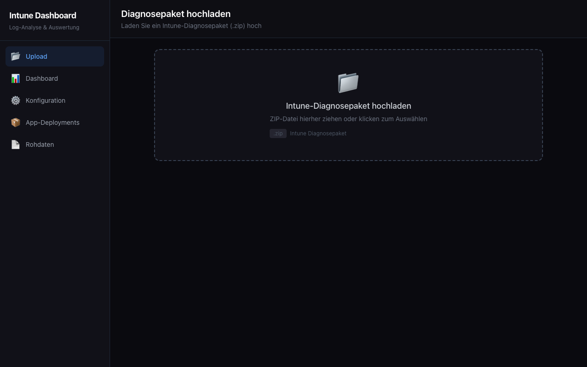
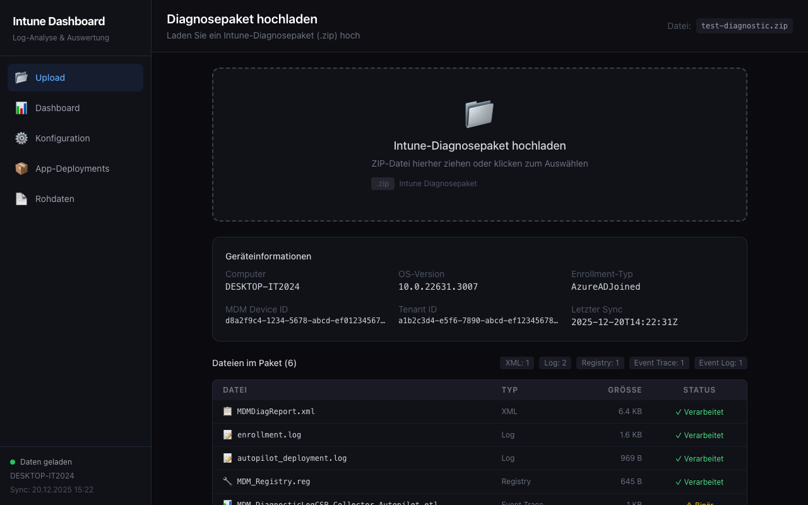
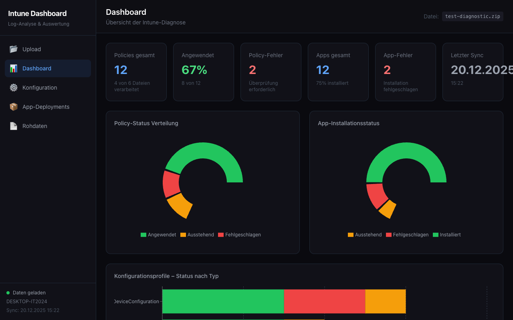
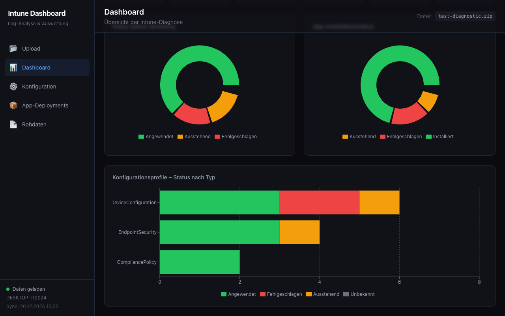
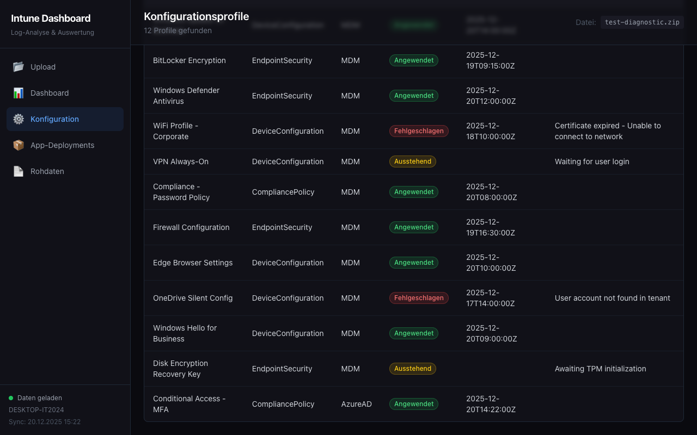
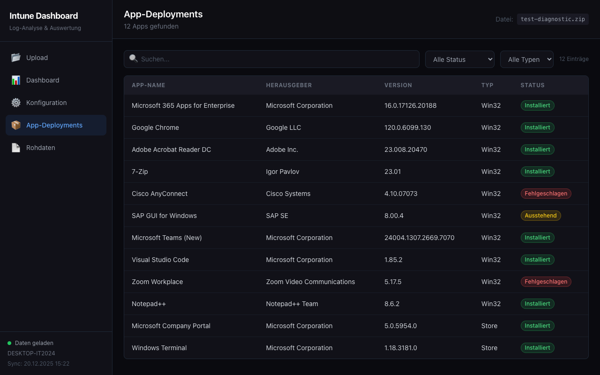
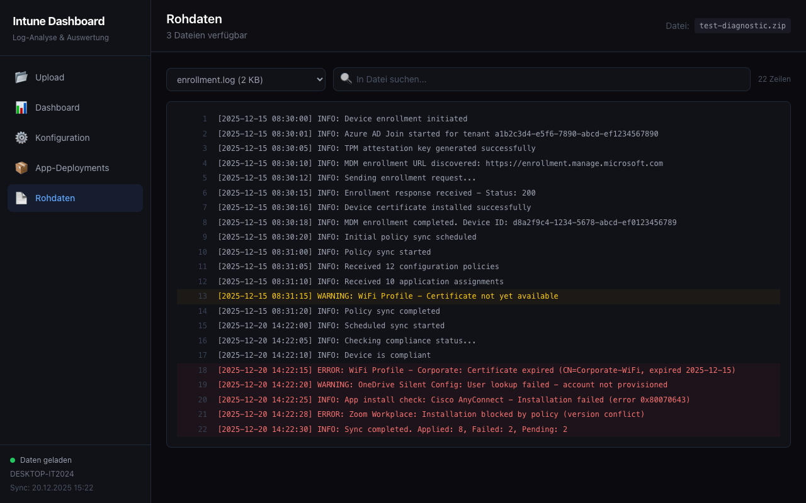

# Intune M365 Log Dashboard

Browser-basiertes Dashboard zur Auswertung von **Microsoft Intune-Diagnosepaketen** (ZIP).
Laden Sie ein via "Diagnose sammeln" erstelltes ZIP hoch und erhalten Sie sofort eine visuelle Analyse.

## Features

- **ZIP-Upload** mit Drag-and-Drop - automatische Erkennung und Verarbeitung aller Dateien
- **KPI-Dashboard** mit Echtzeit-Metriken (Policies, Apps, Fehlerquoten, Sync-Status)
- **Interaktive Charts** - Donut-Diagramme und gestapelte Balkendiagramme (Recharts)
- **Konfigurationsprofile** - filterbare, sortierbare Tabelle mit Status-Badges
- **App-Deployments** - Installationsstatus aller verwalteten Anwendungen
- **Rohdaten-Viewer** - Log-Dateien mit Suchfunktion und farbiger Hervorhebung
- **Dark Mode** Design

## Screenshots

### Upload & Dateianalyse
ZIP hochladen, Geräteinformationen einsehen und alle enthaltenen Dateien mit Parse-Status prüfen.




### Dashboard mit KPIs & Charts
Auf einen Blick: Policy-Erfolgsrate, App-Fehler, letzter Sync und Statusverteilung.




### Konfigurationsprofile
Alle MDM-Policies durchsuchbar mit Status-Filter und Sortierung.



### App-Deployments
Installationsstatus aller Win32- und Store-Apps.



### Rohdaten-Viewer
Log- und Registry-Dateien mit Zeilennummern, Suche und ERROR/WARN-Hervorhebung.



## Schnellstart

```bash
# Repository klonen
git clone https://github.com/jschadock/intune-dashboard.git
cd intune-dashboard

# Abhängigkeiten installieren
npm install

# Entwicklungsserver starten
npm run dev
```

Dann `http://localhost:5173` im Browser öffnen.

## Intune-Diagnosepaket erstellen

1. **Microsoft Intune Admin Center** öffnen (`intune.microsoft.com`)
2. **Geräte** > Gerät auswählen > **Diagnose sammeln**
3. Warten bis die Sammlung abgeschlossen ist
4. ZIP-Datei herunterladen
5. In das Dashboard hochladen

## Unterstützte Dateitypen im ZIP

| Dateityp | Verarbeitung |
|----------|-------------|
| `MDMDiagReport.xml` | Vollständig geparst (Policies, Apps, Gerätedaten) |
| `*.log` | Textanzeige mit Syntax-Hervorhebung |
| `*.reg` | Registry-Exporte als Text |
| `*.html` | Fallback-Anzeige |
| `*.etl` / `*.evtx` | Nur Metadaten (Binärdateien) |

## Tech Stack

| Bereich | Technologie |
|---------|------------|
| Framework | React 19 + TypeScript |
| Build | Vite 8 |
| Styling | Tailwind CSS 3 (Dark Mode) |
| Charts | Recharts 3 |
| State | Zustand 5 |
| ZIP-Parsing | JSZip |
| XML-Parsing | Browser DOMParser (nativ) |
| Routing | React Router 7 |

## Projektstruktur

```
src/
├── components/
│   ├── charts/      # Recharts-Diagramme (Pie, Bar)
│   ├── kpi/         # KPI-Karten mit Metriken
│   ├── layout/      # AppShell, Sidebar, TopBar
│   ├── rawlogs/     # Log-Viewer mit Syntax-Highlighting
│   ├── table/       # Sortierbare Tabellen mit Filter
│   └── upload/      # Drag-and-Drop DropZone
├── hooks/           # useZipUpload, useDeviceMetrics, useTableFilters
├── pages/           # Upload, Dashboard, Config, Apps, RawLogs
├── services/        # ZIP-Extraktion, MDM-XML-Parser, Log-Parser
├── stores/          # Zustand State Management
├── types/           # TypeScript Typen
└── utils/           # Farbpaletten, Datums-Utilities
```

## Lizenz

MIT
